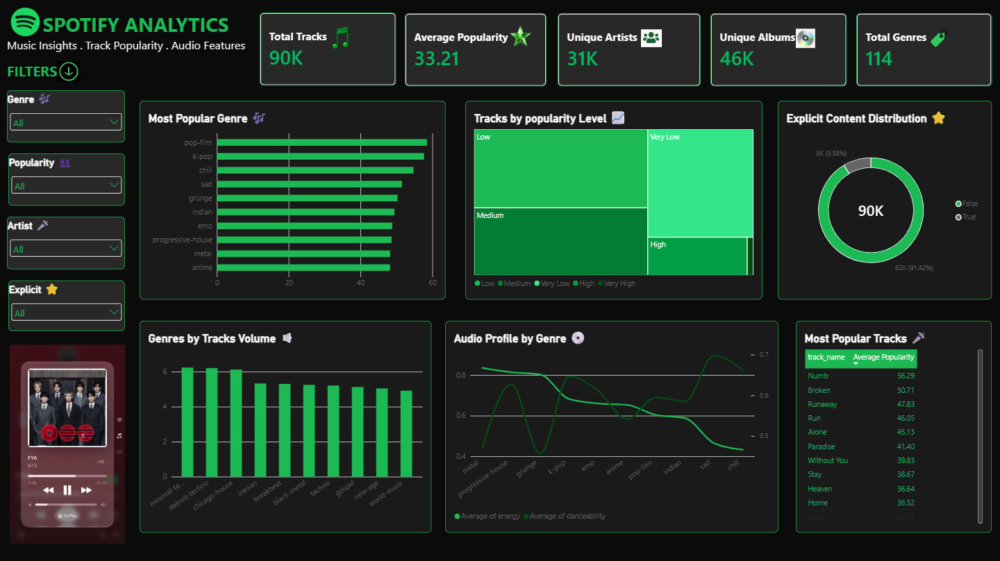
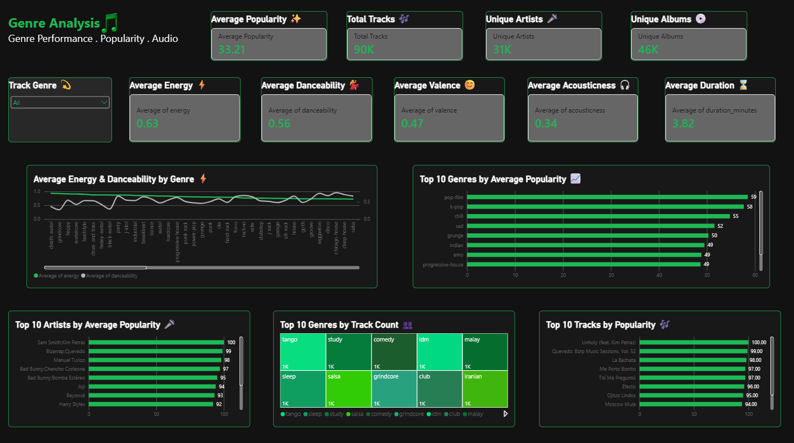
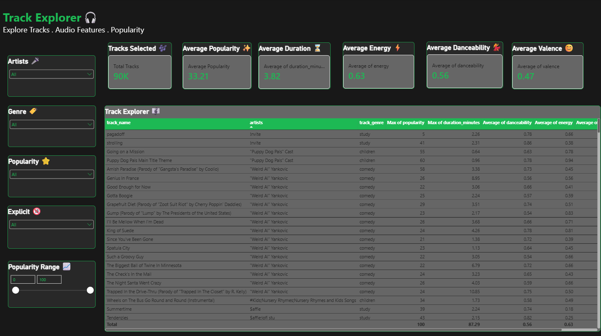

# 🎵 Spotify Analytics Dashboard

An interactive **Spotify Analytics Dashboard built using Microsoft Power BI**, designed to analyze music trends across tracks, genres, artists, albums, popularity, and audio features.

## 📊 Dashboard Preview

### 1. Spotify Overview

The overview page provides a high-level view of the Spotify dataset, including key KPIs, genre popularity, popularity distribution, explicit content, audio features, and top tracks.

### 2. Genre Analysis

The genre analysis page explores genre-level performance through popularity, track volume, energy, danceability, valence, acousticness, and top artists/tracks.

### 3. Track Explorer

The Track Explorer provides interactive track-level analysis with filters for artist, genre, popularity, explicit content, and popularity range.

## 🔍 Key Insights

- 🎵 90K+ tracks analyzed
- 🎤 31K+ unique artists
- 💿 46K+ unique albums
- 🏷️ 114 genres
- ⭐ Average popularity: 33.21
- ⚡ Average energy: 0.63
- 💃 Average danceability: 0.56
- 😊 Average valence: 0.47

## 🛠️ Tools & Technologies

- Microsoft Power BI
- DAX
- Power Query
- Excel
- Data Analysis
- Data Visualization
- Interactive Dashboard Design

## 📌 Dashboard Features

- Interactive filters and slicers
- KPI cards
- Genre-level analysis
- Track popularity analysis
- Audio feature analysis
- Explicit content distribution
- Artist and album analysis
- Track-level exploration

## 📂 Project File

The Power BI `.pbix` file is included in this repository for reference.

## 👩‍💻 Author

**Likhitha Divvela**

Aspiring Data Analyst | Microsoft Power BI | Power Query | Data Analysis | Data VIsualization | DAX Measures | Interactive Dashboard Design 
